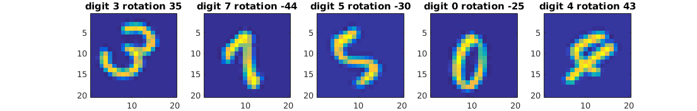
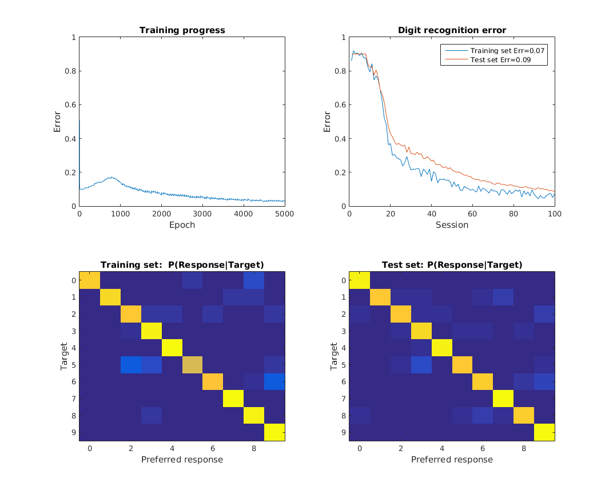

# Digit perception

- *Digits20x20.mat* is a mat-file containing images of digits. Hereafter some samples.

- digitdata.m is a reader of that file and prepares a balances set of images for training, test, and validation

- Hereafter the training progress of a simple MLP-based model of digit perception showing classification error and confusion matrix

