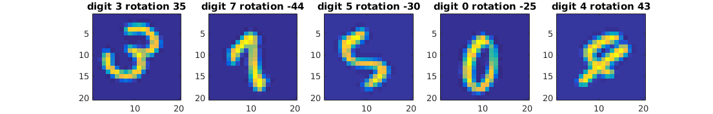
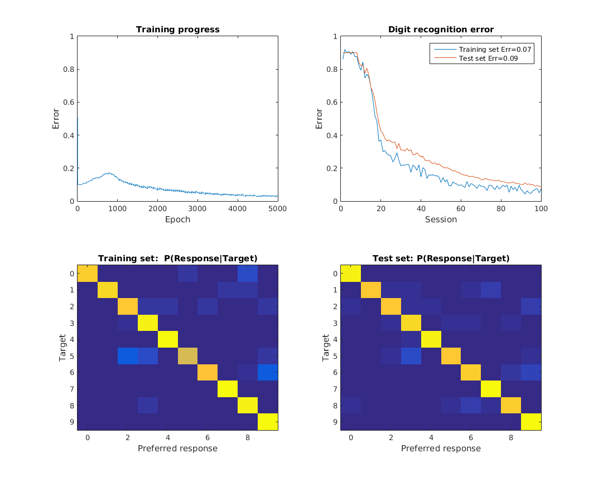
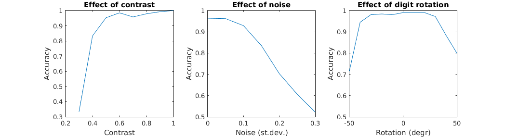
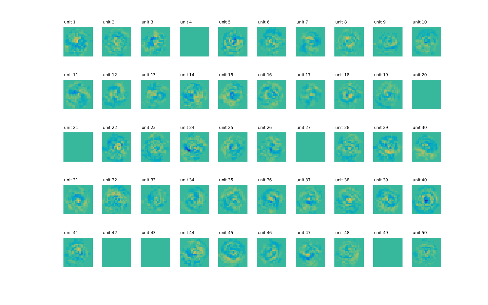
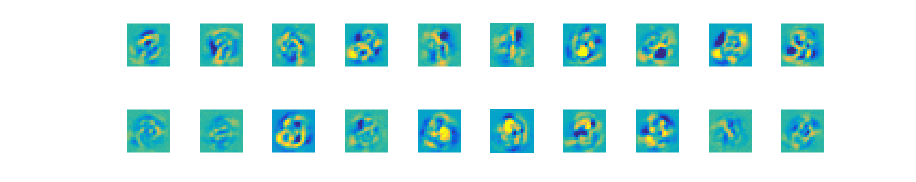
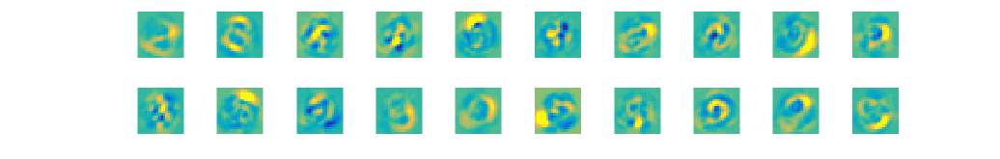

# Digit perception

- *Digits20x20.mat* is a mat-file containing images of digits. Hereafter some samples.

## Data samples

- digitdata.m is a reader of that file and prepares a balances set of images for training, test, and validation

- Hereafter the training progress of a simple MLP-based model of digit perception showing classification error and confusion matrix

# A Feed-forward model of digits

- *digitperc.m* is the main script which:
  - sets parameters, 
  - loads the dataset *D=digitdata(tr_size,te_size,va_size)*, 
  - initializes a MLP network N=mlp(size-vector,params)
  - runs the training function *mlp_train(NN,X,T,nepochs)* and calls on-line analysis of the learning process *digitperc_analysis(NN,D)*, 
  - runs psychophysical analysis of the trained network *contrast_profile(NN,D)*, *noise_profile(NN,D)*, *rotation_profile(NN,D)*
  - shows the unit weights as images *plot_hweights(NN)*, *plot_oweights(NN)* to allow inside visual analysis of the network computations.

## training profile

## Psychophysical performance Profile
   

## Hiden units
   

## Output units
  

# Deep Generative Model of digits

- *deepdigitperc.m* is the main script which:
  - sets parameters, 
  - loads the dataset *D=digitdata(tr_size,te_size,va_size)*, 
  - initializes a DBN network N=dbn(size-vector,params)
  - runs the training function *dbn_train(NN,X,nepochs)*
  - call MLP-training *deepdigitperc_mlp*; 

- *deepdigitperc_mlp.m* trains a MLP and profiles the entire deep model
  

## Layer1
   sample DBN features at layer1

## Layer2
sample DBN features at layer2  

